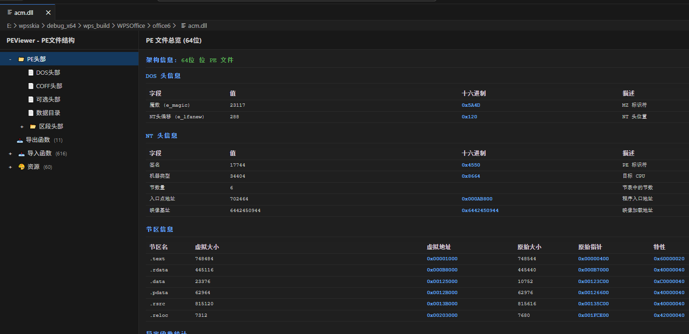

**[中文版本 (Chinese Version)](README.zh-cn.md)**

# PEViewer - PE/ELF File Viewer & Analyzer

A professional VS Code extension for viewing and analyzing Windows PE (Portable Executable) and Linux ELF (Executable and Linkable Format) file structures. Features advanced capabilities including import/export symbol parsing, resource viewing, and automatic function name demangling.



## Features

### Core Capabilities

- 📁 **Structured View**: Display PE/ELF file components in an intuitive tree structure
- 🔍 **Detailed Information**: View headers, section tables, symbol tables, and more
- 📊 **Multi-format Display**: Show decimal, hexadecimal, and binary formats simultaneously
- 💻 **VS Code Integration**: Perfectly integrated with VS Code themes and interface
- 🌐 **Multi-language Support**: Available in English and Chinese

### Windows PE File Support

- 🚀 **Dumpbin Integration**: Automatically uses Visual Studio's dumpbin tool on Windows for more accurate parsing
- 📊 **Smart Fallback**: Automatically uses built-in parser when dumpbin is unavailable, ensuring cross-platform compatibility
- 📦 **Import/Export Tables**: View DLL import functions and export function lists
- 🎨 **Resource Viewer**: View icons, bitmaps, string tables, version info, and more
- 🔧 **Function Name Decoding**: Automatically decode MSVC/Itanium/Rust symbol names
- 🔎 **Search Functionality**: Quickly search through imports and exports
- 📄 **Pagination**: Browse large function lists with pagination support

### Linux ELF File Support

- 🐧 **Complete Parsing**: Full support for Linux .so shared object files
- 📊 **Architecture Support**: x86, x86-64, ARM, AArch64, RISC-V, and more
- 📜 **Symbol Tables**: Export symbols with address, size, type, and binding info
- 🔗 **Dependencies**: Smart parsing of imported symbols and library dependencies
- 🛠️ **Multi-system**: Supports HarmonyOS, Android, Linux compiled SO libraries

## Use Cases

- 🔍 **Reverse Engineering**: Analyze binary file structures and understand program behavior
- 🐛 **Troubleshooting**: Check DLL/SO dependencies and resolve loading issues
- 🔧 **Development**: View exported symbols after compilation and verify build results
- 📚 **Learning**: Study PE/ELF file formats and understand operating system principles
- ⚙️ **Cross-platform**: Check architecture and symbol compatibility of cross-platform libraries

## Usage

1. Install this extension
2. Open a PE file (like .exe or .dll) in VS Code
3. Right-click the file and select **"Open With"** > **"code"**
4. Click on various nodes in the left tree view to see detailed information

## Supported File Types

- `.exe` - Executable files
- `.dll` - Dynamic Link Libraries
- `.ocx` - ActiveX Controls
- `.sys` - System drivers
- `.scr` - Screen savers
- `.drv` - Driver programs
- `.cpl` - Control Panel programs

## Installation

### Install from VS Code Marketplace

1. Open VS Code
2. Press `Ctrl+Shift+X` to open Extensions view
3. Search for **"PE/ELF Viewer"** or **"PEViewer"**
4. Click **Install** button

### Install from VSIX File

1. Download the `.vsix` file
2. Press `Ctrl+Shift+P` to open Command Palette in VS Code
3. Type **"Extensions: Install from VSIX..."**
4. Select the downloaded `.vsix` file

## Version History

### 2.0.0 (2025-12-17)

#### Major Updates

- 🚀 **Dumpbin Integration**: Prioritizes Visual Studio's dumpbin tool on Windows for more accurate PE file parsing
- 🔄 **Smart Fallback**: Automatic detection and fallback to built-in parser, ensuring cross-platform compatibility
- 📁 **Project Restructuring**: Modular architecture with separate PE/ELF/LIB parser management
- 🔍 **COFF/LIB Enhancements**: Symbol search, export symbol display, and parsing fixes

### 1.2.0 (2025-12-16)

#### New Features

- 📦 **LIB/COFF File Support**: Complete .lib static library file parsing
- 🔍 **ELF Dependency Info**: Display associated dependency library for each imported function
- 📋 **ELF Header Optimization**: Complete display of file header, program header, and section header structures

### 1.0.251206 (2024-12-06)

- ✨ Basic PE file structure viewer
- 📁 Tree view for file navigation
- 🔍 Detailed information panels
- 📊 Import/Export table parsing
- 🎨 Resource section viewer
- 💻 VS Code theme integration

For detailed changes, see [CHANGELOG.md](CHANGELOG.md).

## Multi-language Support

Supports Chinese and English interfaces, automatically adapts to VS Code language settings.

## Development

```bash
npm install
npm run compile

npm run format
```

## License

MIT
